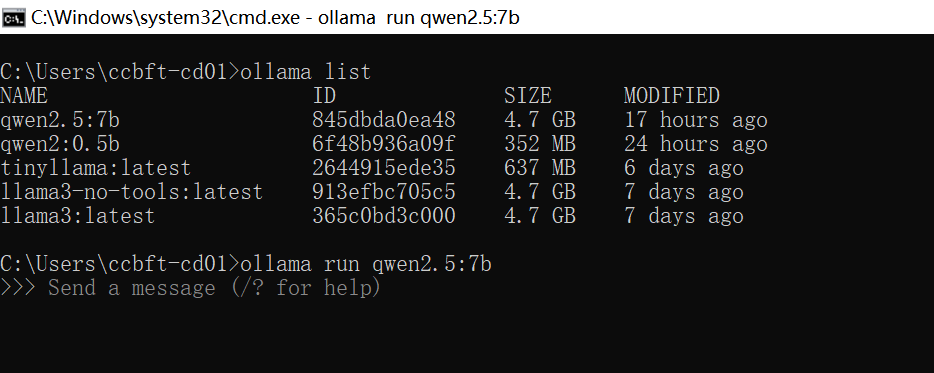
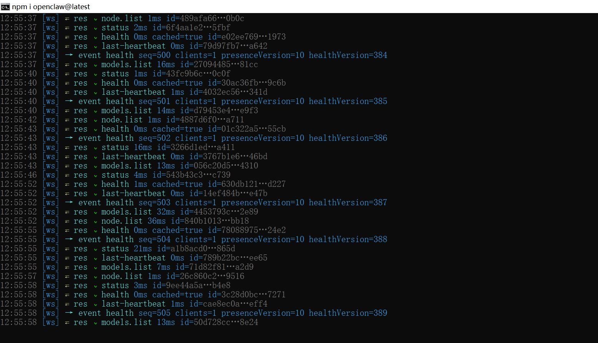
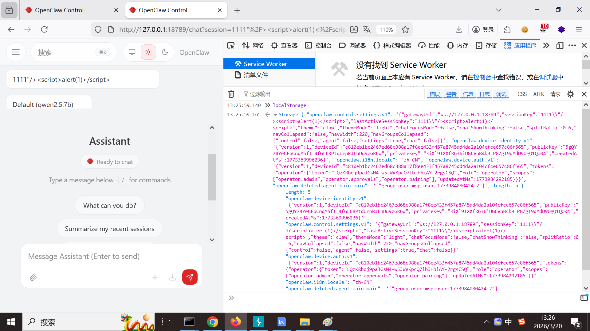

Private Key Leakage Vulnerability in OpenClaw v2026.3.13

Discoverer: Terry Tian

Credits: westsec Security Team!

1.  Introduction to Vulnerable Project and Affected Version

    Project Overview

Open-source Project:[openclaw/openclaw](https://github.com/openclaw/openclaw)

Project Repository:[https://github.com/openclaw/openclaw](https://github.com/openclaw/openclaw)

Official Demo/Blog URL: [https://openclaw.ai](https://openclaw.ai)

Project Description: \"Your own personal AI assistant. Any OS. Any
Platform. The lobster way.\"

Affected Version

Version Number: v2026.3.13 (Latest stable release)

Release Page:[https://github.com/openclaw/openclaw/releases](https://github.com/openclaw/openclaw/releases)

2.  Vulnerability Environment Construction: Ollama + Qwen Large Model

Launch the Qwen large model, as shown in the figure:

ollama run qwen2.5:7b

Launch the OpenClaw gateway, as shown in the figure:

openclaw gateway \--port 18789 \--verbose

3.  Vulnerability Proof Process

The vulnerable software version is: OpenClaw 2026.3.13, as shown in the
figure:

Functional points and specific process of the software vulnerability, as
shown in the figure:After successful login to the background, execute
the command localStorage directly in the browser console; the console
will display the session public key and private key, resulting in the
leakage of the session private key (privateKey), as shown in the figure:

<http://127.0.0.1:18789/chat?session=1111%22%2F%3E%3Cscript%3Ealert%281%29%3C%2Fscript%3E>

Remediation Recommendations: Prevent private key leakage!