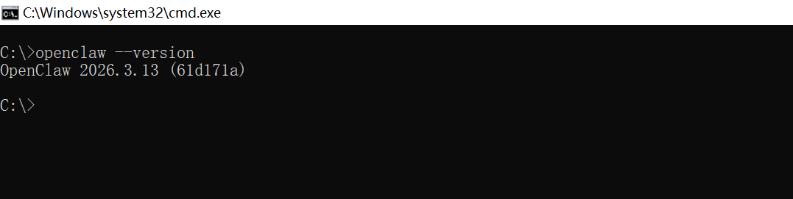
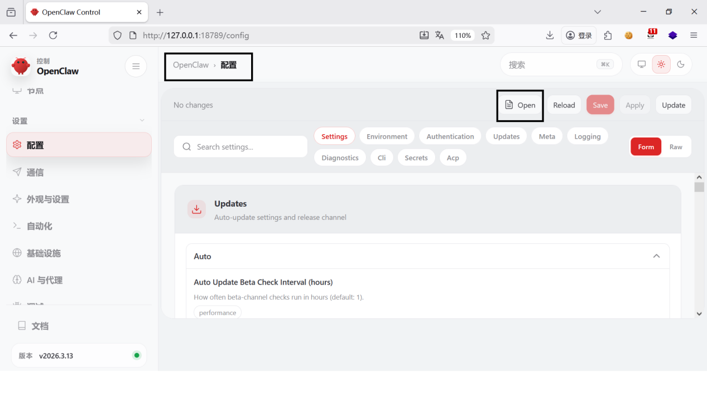
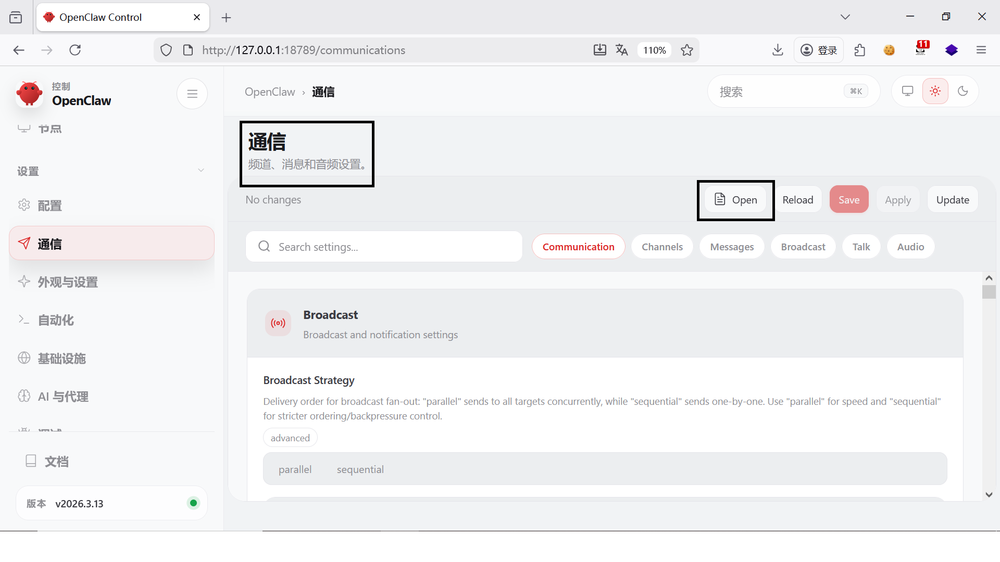
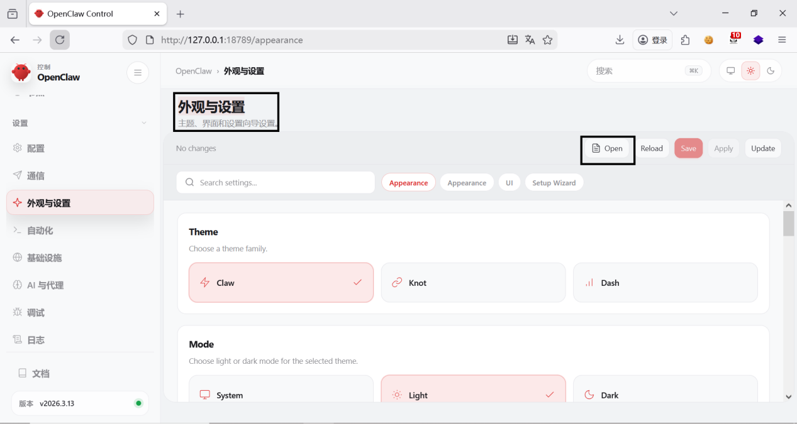
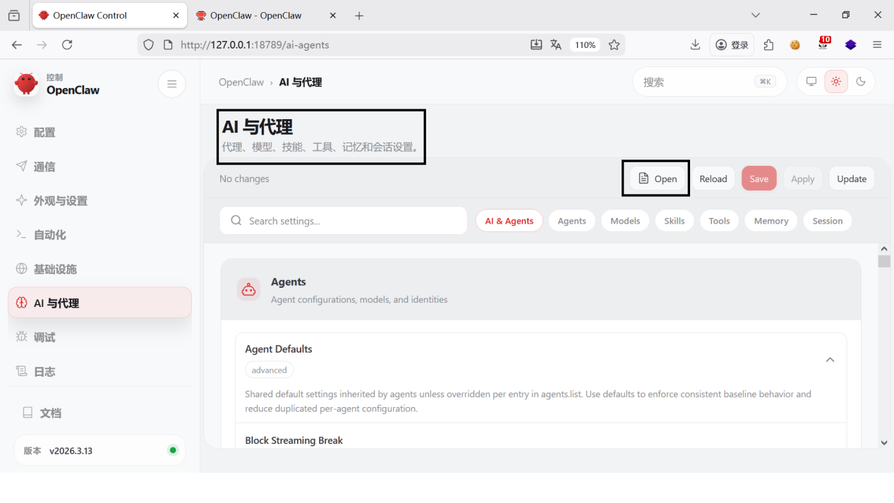
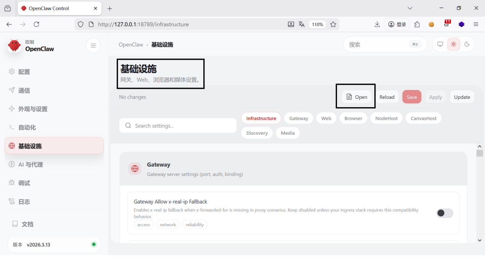
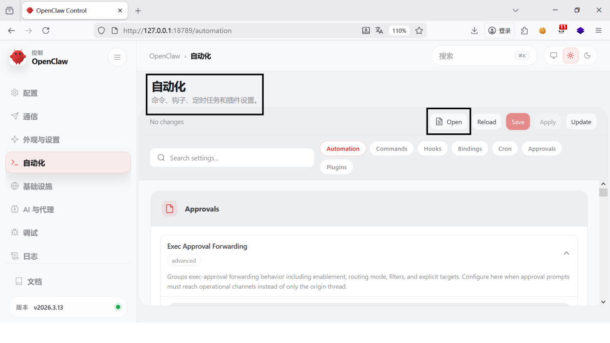
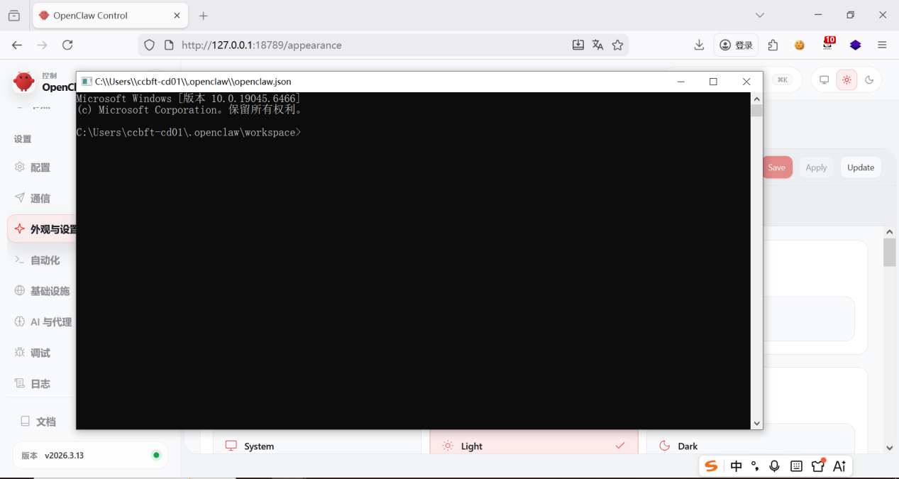
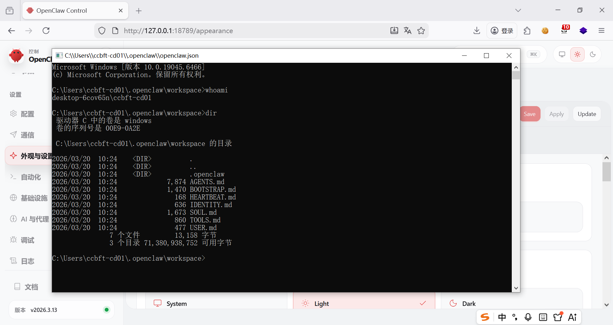

Command Execution Vulnerability in OpenClaw v2026.3.13

Discoverer: Terry Tian

Credits: westsec Security Team!

1.  Introduction to Vulnerable Project and Affected Version

    Project Overview

Open-source Project:[openclaw/openclaw](https://github.com/openclaw/openclaw)

Project Repository:[https://github.com/openclaw/openclaw](https://github.com/openclaw/openclaw)

Official Demo/Blog URL: [https://openclaw.ai](https://openclaw.ai)

Project Description: \"Your own personal AI assistant. Any OS. Any
Platform. The lobster way.\"

Affected Version

Version Number: v2026.3.13 (Latest stable release)

Release Page:[https://github.com/openclaw/openclaw/releases](https://github.com/openclaw/openclaw/releases)

2.  Vulnerability Environment Construction: Ollama + Qwen Large Model

Launch the Qwen large model, as shown in the figure:

ollama run qwen2.5:7b

Launch the OpenClaw gateway, as shown in the figure:

openclaw gateway \--port 18789 \--verbose

3.  Vulnerability Proof Process

The vulnerable software version is: OpenClaw 2026.3.13, as shown in the
figure:

Functional points and specific processes of the software vulnerability,
as shown in the figure:Log in to the background, click Configuration,
Communication, Appearance and Settings, AI & Agents, Infrastructure or
Automation, then click Open --- the system will directly launch the
command console by default, as shown in the figure:

At this point, system commands can be executed directly in the command
console, as shown in the figure:

Remediation Recommendations: Direct access to the command console is
strictly prohibited. Restrict operational privileges to the minimum
necessary---only allow opening, editing, and saving the required
configuration files.